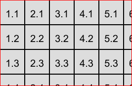

# Drawer

Рисовашка для картиночных заглушек

## Базовая настройка

Для работы необходим:
 - <a href="https://nodejs.org">NodeJS</a>
 - зависимости <a href="https://github.com/Automattic/node-canvas">node-canvas</a>

Установка:<br>
```
npm install
```

Запуск (Сделает случайную картинку в папке /save):<br>
```
npm start
```

## Example
```
var drawer = require('./drawer/init');

drawer
    .rectSize(50, 50)
    .color('background', '#FFF')
    .create('save/image.png', 300, 200);
```

Result:



## API
Смена цвета
```
.color('background', color)
.color('text', color)
.color('border', color)
.color('cell', color)
```

Смена шрифта
```
.font('20px Arial')
```

Смена размера ячейки
```
.rectSize(width, height)
```

Запрос создания файла
```
.create(url, width, height)
```
